# Tessera Protocol

<div align="center">

**A next-generation blockchain protocol with hybrid storage, advanced tokenomics, and built-in security**

[](LICENSE)
[](https://nodejs.org)
[](https://github.com/TesseraNetwork/TesseraNetwork)

[Features](#-features) • [Quick Start](#-quick-start) • [Documentation](#-documentation) • [Architecture](#-architecture) • [Tokenomics](#-tokenomics)

</div>

---

## 📋 Overview

Tessera Protocol is a complete blockchain infrastructure designed from the ground up for security, performance, and sustainable tokenomics. Unlike traditional blockchains, Tessera utilizes a hybrid storage architecture that combines high-speed caching with persistent ledger technology, enabling unprecedented transaction throughput while maintaining data integrity.

The protocol includes everything needed to run a decentralized network: validator nodes, account management, transaction processing, staking mechanisms, and a comprehensive tokenomics model with treasury management, community pools, and vesting schedules.

### Key Highlights

- 🔐 **Cryptographically Secure**: Ed25519 signatures, nonce validation, and replay attack prevention
- ⚡ **High Performance**: Hybrid hot/cold storage architecture for optimal speed and reliability
- 🎯 **Production Ready**: Integrated Cloudflare Tunnel support, proxy layer, and enterprise-grade infrastructure
- 🏦 **Sustainable Tokenomics**: Built-in treasury, community governance pools, and team vesting schedules
- 🎁 **Staking Rewards**: Flexible staking system with configurable APY and lock periods
- 🛠 **Developer Friendly**: Complete CLI tooling, comprehensive APIs, and extensive documentation

---

## ✨ Features

### Protocol Layer

- **Distributed Consensus**
  - Validator node infrastructure
  - State synchronization across nodes
  - Block production and validation

- **Account System**
  - Cryptographic key pair generation (Ed25519)
  - Hierarchical account structure
  - Balance tracking and account history

- **Transaction Engine**
  - Signature-based authentication
  - Nonce-based ordering and replay prevention
  - Atomic transaction execution
  - Transaction pool management

### Economic Layer

- **Native Token**
  - Fixed total supply with controlled distribution
  - Treasury-managed circulation
  - Burn mechanisms for deflationary pressure

- **Staking Mechanism**
  - Flexible staking with multiple lock periods
  - Dynamic APY calculation
  - Automatic reward distribution
  - Slashing protection

- **Governance & Vesting**
  - Community governance pool
  - Team vesting schedules with cliffs
  - Treasury management system
  - On-chain voting capabilities (planned)

### Infrastructure Layer

- **Hybrid Storage Architecture**
  - Hot State: Upstash Redis for microsecond latency
  - Cold Ledger: Base44 for immutable, persistent storage
  - Automatic sync and reconciliation
  
- **Network Security**
  - Cloudflare Tunnel integration
  - Request sanitization proxy
  - DDoS protection
  - Rate limiting and abuse prevention

- **API Gateway**
  - RESTful JSON API
  - WebSocket support (planned)
  - GraphQL endpoints (planned)
  - Comprehensive error handling

---

## 📚 Documentation

Comprehensive documentation is available in the `docs/` directory:

| Document | Description |
|----------|-------------|
| [White Paper](docs/WHITEPAPER.md) | Protocol design, consensus mechanism, cryptographic foundations, and economic model |
| [Deployment Guide](docs/deployment_guide.md) | Production deployment, validator setup, and infrastructure configuration |
| [Developer Guide](docs/developer_guide.md) | API reference, SDK usage, smart contract development, and contribution guidelines |
| [Tokenomics Paper](docs/TOKENOMICS.md) | Detailed breakdown of token distribution, vesting, and economic incentives |

---

## 🏗 Architecture

Tessera Protocol employs a multi-layered architecture designed for scalability and security:

```mermaid
graph TD
    User[👤 Users & dApps] -->|HTTPS/WSS| CF[🌐 Cloudflare Tunnel]
    CF -->|Secure Routing| Proxy[🔄 Tessera Proxy Layer]
    Proxy -->|Request Validation| Gateway[🚪 API Gateway]
    
    Gateway -->|Fast Reads/Writes| Hot[⚡ Hot State<br/>Upstash Redis]
    Gateway -->|Authoritative Storage| Cold[❄️ Cold Ledger<br/>Base44]
    
    Gateway -->|Process| TxPool[📋 Transaction Pool]
    TxPool -->|Validate| Consensus[⚖️ Consensus Engine]
    Consensus -->|Finalize| Blocks[🔗 Block Production]
    
    Blocks -->|Update| Hot
    Blocks -->|Persist| Cold
    
    CLI[🛠 CLI Tools] -.->|Direct Access| Gateway
    Validators[🔍 Validator Nodes] -->|Sync| Gateway
    
    style Hot fill:#ff6b6b
    style Cold fill:#4ecdc4
    style Gateway fill:#95e1d3
    style Consensus fill:#f38181
```



### Component Breakdown

| Component | Purpose | Technology |
|-----------|---------|------------|
| **API Gateway** | Central request router and orchestrator | Node.js, Express |
| **Tessera Proxy** | Security layer for request sanitization | Node.js |
| **Hot State Cache** | High-speed account and state storage | Upstash Redis |
| **Cold Ledger** | Immutable transaction and block storage | Base44 |
| **Transaction Pool** | Pending transaction queue and validation | In-memory |
| **Consensus Engine** | Block production and finalization | Custom implementation |
| **CLI Tools** | Developer utilities and operations scripts | Node.js |

---

## 💰 Tokenomics

Tessera Protocol implements a carefully designed token economy:

### Token Distribution

```
Total Supply: 1,000,000,000 TESS

├─ Treasury (40%)           400,000,000 TESS
├─ Community Pool (25%)     250,000,000 TESS
├─ Team Vesting (20%)       200,000,000 TESS
├─ Staking Rewards (10%)    100,000,000 TESS
└─ Initial Validators (5%)   50,000,000 TESS
```

### Vesting Schedule

- **Team Tokens**: 24-month linear vest with 6-month cliff
- **Community Pool**: Governance-controlled distribution
- **Staking Rewards**: Dynamic APY based on total staked amount

### Economic Mechanisms

- **Staking APY**: 5-20% variable based on network participation
- **Transaction Fees**: Paid in TESS, partially burned for deflation
- **Validator Rewards**: Block production incentives
- **Governance Rights**: Stake-weighted voting power (coming soon)

---

## 🚀 Quick Start

### Prerequisites

Before you begin, ensure you have:

- **Node.js** v18 or higher ([Download](https://nodejs.org))
- **npm** (comes with Node.js)
- **cloudflared** executable ([Download](https://github.com/cloudflare/cloudflared))
- **Base44 API Access** with API key ([Sign up](https://base44.com))
- **Upstash Redis** account with URL and token ([Sign up](https://upstash.com))

### Installation

1. **Clone the repository**
   ```bash
   git clone https://github.com/TesseraNetwork/TesseraNetwork.git
   cd tessera
   ```

2. **Install dependencies**
   ```bash
   npm install
   cd tessera-proxy
   npm install
   cd ..
   ```

3. **Configure environment variables**
   
   Create `.env` in the project root:
   ```env
   # Base44 Configuration
   BASE44_URL=https://app.base44.com/api/apps/YOUR_APP_ID/entities
   BASE44_KEY=your_base44_api_key_here
   
   # Upstash Configuration
   UPSTASH_URL=your_upstash_redis_url_here
   UPSTASH_TOKEN=your_upstash_token_here
   ```
   
   Create `tessera-proxy/.env`:
   ```env
   CLOUDFLARE_TUNNEL_URL=https://your-tunnel-url.trycloudflare.com
   ```

### Running the Protocol

Launch the complete stack in separate terminal windows:

1. **Start the API Gateway** (Terminal 1)
   ```bash
   node bin/gateway.js
   ```
   ✅ Gateway running on `http://localhost:3000`

2. **Start the Tessera Proxy** (Terminal 2)
   ```bash
   cd tessera-proxy
   node index.js
   ```
   ✅ Proxy running on `http://localhost:8080`

3. **Start Cloudflare Tunnel** (Terminal 3)
   ```bash
   ./tools/cloudflared-linux-amd64 tunnel --url http://localhost:8080
   ```
   ✅ Public URL: `https://[random].trycloudflare.com`

### Initialize the Network

For a fresh deployment:

```bash
# Clear all existing data (⚠️ WARNING: Irreversible!)
bash bin/reset.sh

# Initialize genesis block with tokenomics
node bin/genesis-init.js
```

✅ Network initialized with treasury, pools, and vesting schedules!

---

## 🛠 Usage Examples

### Managing Accounts

**Generate a new account:**
```bash
node bin/keygen.js
```
Output:
```
✅ Account Created Successfully!
━━━━━━━━━━━━━━━━━━━━━━━━━━━━━━━━━━━━━
PUBLIC ADDRESS:  0x1a2b3c4d5e6f7g8h9i0j
PRIVATE KEY:     a1b2c3d4e5f6g7h8i9j0k1l2m3n4o5p6q7r8s9t0

⚠️  IMPORTANT: Store your private key securely!
   Never share it with anyone.
━━━━━━━━━━━━━━━━━━━━━━━━━━━━━━━━━━━━━
```

**Check account balance:**
```bash
curl http://localhost:3000/account/0x1a2b3c4d5e6f7g8h9i0j
```

### Processing Transactions

**Transfer from treasury (admin operation):**
```bash
bash bin/transfer.sh 0x1a2b3c4d5e6f7g8h9i0j 10000
```

**Signed transfer between accounts:**
```bash
node bin/sign-transfer.js \
  0xSENDER_ADDRESS \
  0xRECIPIENT_ADDRESS \
  1000 \
  YOUR_PRIVATE_KEY
```

### Staking Operations

**Stake tokens:**
```bash
node bin/staking.js stake 0xYOUR_ADDRESS 5000
```

**Check staking status:**
```bash
node bin/staking.js stats 0xYOUR_ADDRESS
```
Output:
```json
{
  "staked_amount": "5000",
  "reward_rate": "0.15",
  "pending_rewards": "125.50",
  "lock_until": "2026-03-07T00:00:00Z"
}
```

**Claim rewards:**
```bash
node bin/staking.js claim 0xYOUR_ADDRESS
```

### API Endpoints

| Endpoint | Method | Description |
|----------|--------|-------------|
| `/account/:address` | GET | Retrieve account details and balance |
| `/account/create` | POST | Create a new account |
| `/transaction/submit` | POST | Submit a signed transaction |
| `/transaction/:hash` | GET | Get transaction details |
| `/staking/stake` | POST | Stake tokens |
| `/staking/claim` | POST | Claim staking rewards |
| `/staking/stats/:address` | GET | Get staking statistics |
| `/health` | GET | Check node health status |

---

## 🧪 Testing

Run the comprehensive test suite to verify all protocol components:

```bash
# Run all tests
bash test_all.sh

# Test specific components
npm test -- --grep "Account Management"
npm test -- --grep "Transaction Processing"
npm test -- --grep "Staking System"
```

---

## 🛡 Security

Tessera Protocol implements multiple layers of security:

- **Cryptographic Signatures**: All transactions use Ed25519 signatures
- **Nonce Validation**: Prevents replay attacks
- **Secure Mode**: Enforced signature verification on all state changes
- **Rate Limiting**: Protection against spam and DDoS
- **Input Sanitization**: All inputs validated and sanitized
- **Cloudflare Protection**: DDoS mitigation and SSL/TLS encryption

### Reporting Vulnerabilities

If you discover a security vulnerability, please email security@tessera-protocol.io. Do not open public issues for security concerns.

---

## 🤝 Contributing

We welcome contributions from the community! Here's how you can help:

1. **Fork the repository**
2. **Create a feature branch**: `git checkout -b feature/amazing-feature`
3. **Commit your changes**: `git commit -m 'Add amazing feature'`
4. **Push to the branch**: `git push origin feature/amazing-feature`
5. **Open a Pull Request**

Please read [CONTRIBUTING.md](CONTRIBUTING.md) for detailed guidelines.

### Development Setup

```bash
# Install dev dependencies
npm install --include=dev

# Run linter
npm run lint

# Format code
npm run format

# Run tests in watch mode
npm run test:watch
```

---

## 📊 Roadmap

### Phase 1: Foundation (Q1 2026) ✅
- [x] Core protocol implementation
- [x] Hybrid storage architecture
- [x] Basic staking mechanism
- [x] CLI tooling

### Phase 2: Enhancement (Q2 2026) 🔄
- [ ] WebSocket API support
- [ ] Advanced staking features
- [ ] On-chain governance voting
- [ ] Multi-signature wallets

### Phase 3: Ecosystem (Q3 2026) 📋
- [ ] Smart contract platform
- [ ] Developer SDK (JavaScript, Python, Rust)
- [ ] Block explorer
- [ ] Web wallet

### Phase 4: Scaling (Q4 2026) 📋
- [ ] Multi-node consensus
- [ ] Cross-chain bridges
- [ ] Layer 2 scaling solutions
- [ ] Mobile applications

---

## 📜 License

This project is licensed under the MIT License - see the [LICENSE](LICENSE) file for details.

---

## 🌐 Community & Support

- **Website**: [tessera-protocol.io](https://tessera-protocol.io)
- **Documentation**: [docs.tessera-protocol.io](https://docs.tessera-protocol.io)
- **Protocol Dashboard**: [https://tessera-block-scan.base44.app](https://tessera-block-scan.base44.app)
- **Discord**: [Join our community](https://discord.gg/tessera)
- **Twitter**: [@TesseraProtocol](https://twitter.com/TesseraProtocol)
- **Email**: support@tessera-protocol.io

---

## 🙏 Acknowledgments

Built with ❤️ using:
- [Node.js](https://nodejs.org) - Runtime environment
- [Upstash](https://upstash.com) - Serverless Redis
- [Base44](https://base44.com) - Persistent storage
- [Cloudflare](https://cloudflare.com) - Network security
- [TweetNaCl.js](https://github.com/dchest/tweetnacl-js) - Cryptography

---

<div align="center">

**[⬆ back to top](#tessera-protocol)**

Made with 🔷 by the Tessera team

</div>